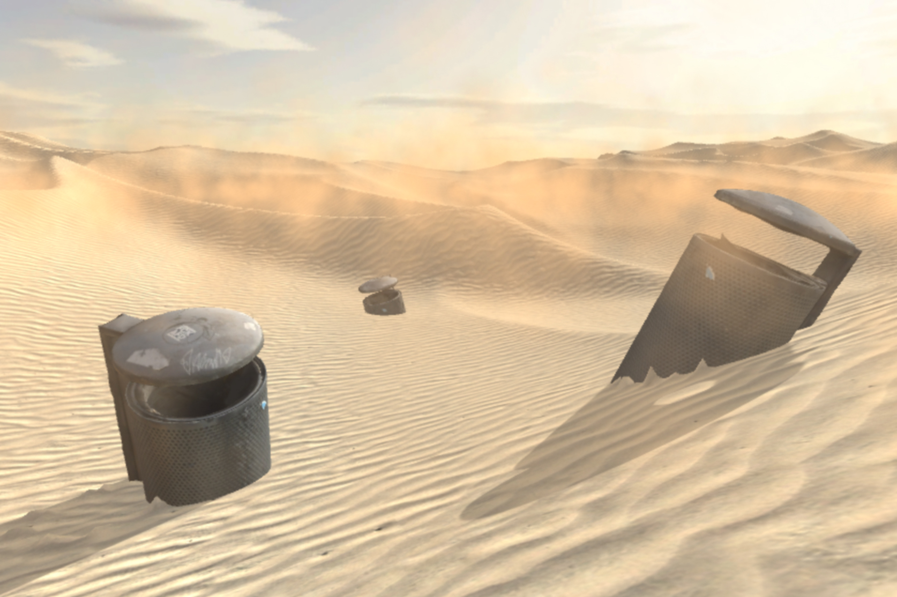

# Post-Apocalypse Smart City Desert

THREE.js maps a 360° video on a sphere. The user sits at its center and the cmaera is controlled by the phones's IMU.

## Description

The smart city has become a new utopia. Visions of urban spaces that are digitally monitored and navigated in a near-totalizing fashion are presented as a way to perfect everyday life in line with consumer culture’s key tropes of innovation, efficiency, and endless growth.

»Post-Apocalypse Smart City Desert« is a prototype for an alternate type of smart city. Instead of optimizing processes, it utilizes digital technology for catastrophic doomsaying in the sense of philosopher Jean-Pierre Dupuy’s writing. Appropriating the QR code as an iconic element of smart cities, it connects trash cans – mundane and often unappreciated artifacts of everyday public space – to a digital space that hints at a post-apocalyptic scenario: After land has degraded into arid plains, trash cans remain in the sand as banal reminders of the inevitable materiality of consumerism.

## URLs

* http://sma.zkm.de/2019/ploeger/?id=smartcity12
* http://sma.zkm.de/2019/ploeger/?id=smartcity25
* http://sma.zkm.de/2019/ploeger/?id=smartcity37
* http://sma.zkm.de/2019/ploeger/?id=smartcity49
* http://sma.zkm.de/2019/ploeger/?id=smartcity51

## Contact

* **Dani Ploeger** - *Artist* - [Profil auf zkm.de](https://zkm.de/de/person/dani-ploeger)
* **Christian Lölkes** - *Software development* - [Profil auf zkm.de](https://zkm.de/de/person/christian-loelkes)
* **Lívia Nolasco-Rózsás** - *Project management* - [Profil auf zkm.de](https://zkm.de/de/person/livia-nolasco-rozsas)

## Links

* **Post-Apocalypse Smart City Desert** - *Description* - [zkm.de](https://zkm.de/de/dani-ploeger)
